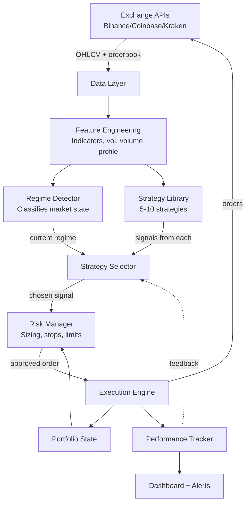
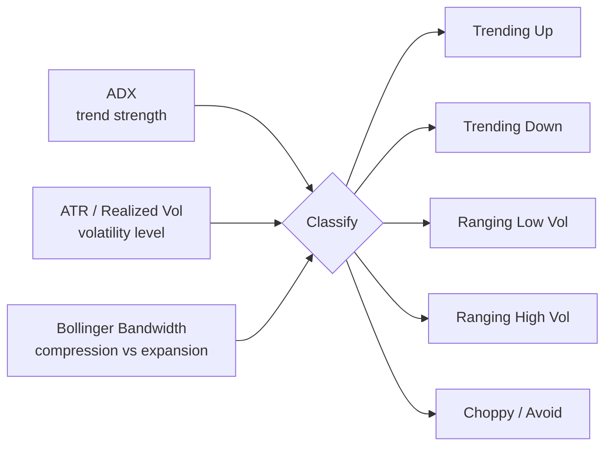
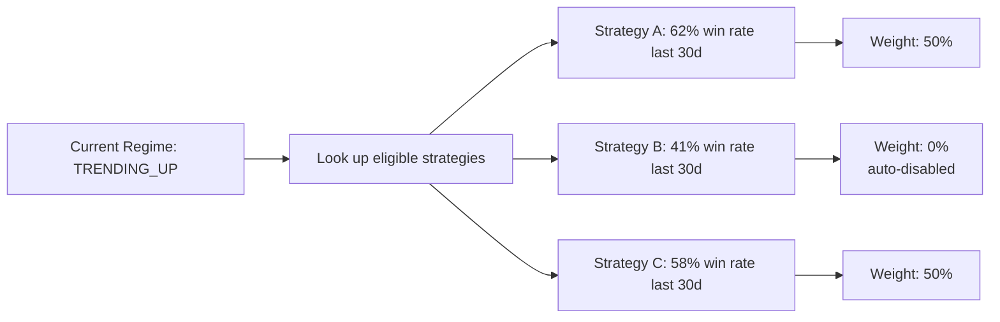
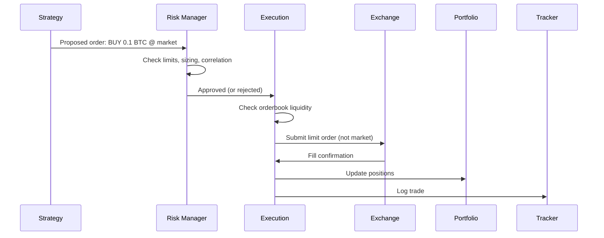
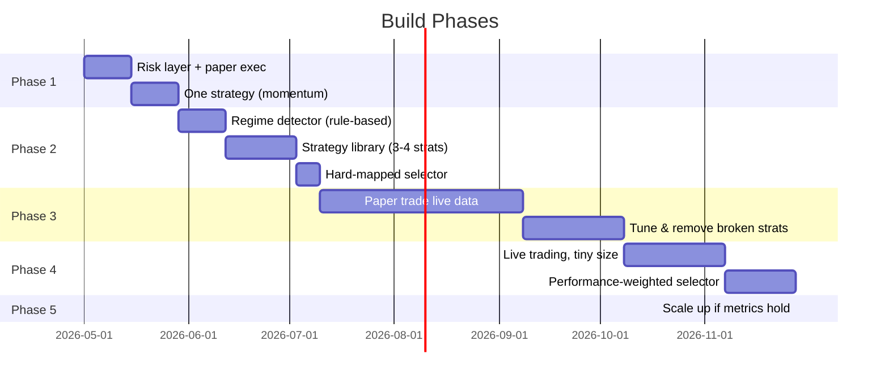
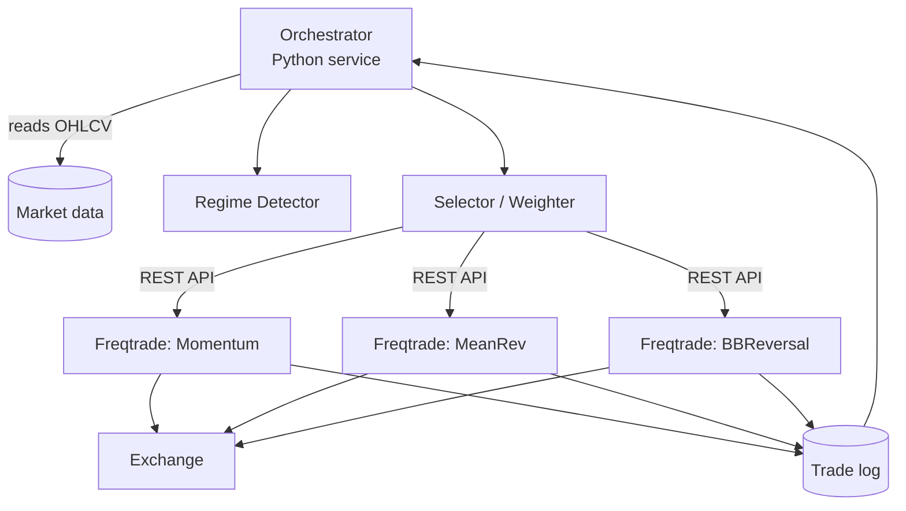

# Adaptive Crypto Trading Bot — Architecture Plan

> **Goal:** A bot that detects what the market is doing right now (trending, ranging, volatile, dead) and automatically picks the strategy best suited to those conditions, sizes positions appropriately, executes trades, and monitors itself.

-----

## ⚠️ Reality Check (read first)

Three things that determine whether this succeeds or fails — and they're not the code:

1. **Strategy selection is the hardest part of algo trading, not the easiest.** Most "regime-aware" bots overfit to backtest data and break in live markets. The plan below assumes this is true and builds defensively around it.
2. **Backtests lie.** A strategy that prints money on historical data routinely loses in live trading because of slippage, fees, latency, and regime shifts the backtest never saw. Forward testing (paper trading) is non-negotiable.
3. **Risk management matters more than strategy.** A mediocre strategy with great risk controls survives. A great strategy with bad risk controls eventually blows up. Build the risk layer *first*.

**Concrete implication:** budget at least 2–3 months of paper trading per strategy before touching real money, and start with capital you'd be fine losing entirely.

-----

## System Overview



-----

## Layer 1 — Data Ingestion

The boring layer that everything else depends on. Get this wrong and nothing downstream works.

| Need                     | Detail                                                           |
| ------------------------ | ---------------------------------------------------------------- |
| Real-time prices         | WebSocket feeds for sub-second latency on the pairs you trade    |
| Historical OHLCV         | Multiple timeframes (1m, 5m, 1h, 4h, 1d) for ~2+ years           |
| Order book depth         | Top 20 levels, used for slippage estimation and liquidity checks |
| Funding rates            | For perpetual futures if you go that route                       |
| On-chain data (optional) | Whale flows, exchange inflows — useful for regime context        |

**Decision:** spot-only or perpetuals? Perpetuals add leverage (good and bad) and funding rate complexity. Recommend **spot-only for v1**.

-----

## Layer 2 — Market Regime Detection ("the intelligent part")

This is the brain. It classifies what the market is doing so the bot knows which strategy to run. There are three viable approaches:

### Approach A: Rule-based (recommended for v1)

Combine 2–3 well-understood indicators into a regime label.



**Why start here:** explainable, debuggable, hard to overfit. You can read a chart and verify the classifier was right.

### Approach B: Hidden Markov Model (HMM)

Statistical model that infers hidden "regimes" from price/volume. Good middle ground — more adaptive than rules, more interpretable than ML.

### Approach C: ML classifier (later, maybe never)

Train a model (XGBoost, LSTM) on labeled historical regimes. Powerful but very easy to overfit. **Skip this until v3 at earliest.**

-----

## Layer 3 — Strategy Library

Each strategy has a *natural habitat* — a regime where it works. The bot's job is to run the right one at the right time.

| Strategy                      | Best Regime                 | How it works                             | Complexity |
| ----------------------------- | --------------------------- | ---------------------------------------- | ---------- |
| **Momentum / Breakout**       | Trending (up or down)       | Buy new highs, sell new lows             | Low        |
| **Mean Reversion (RSI)**      | Ranging, low vol            | Buy oversold, sell overbought            | Low        |
| **Bollinger Band Reversal**   | Ranging, normal vol         | Fade band touches                        | Low        |
| **Donchian Channel Breakout** | Strong trends               | Classic Turtle-style breakouts           | Low        |
| **Grid Trading**              | Sideways, predictable range | Place buy/sell ladder around price       | Medium     |
| **Volatility Expansion**      | Coming out of compression   | Trade direction of breakout from squeeze | Medium     |
| **Funding Rate Arbitrage**    | Any (if using perps)        | Exploit funding payments                 | High       |
| **Stay Flat / Cash**          | Choppy, unclear regime      | Do nothing (this is a *real* strategy)   | Trivial    |

**Critical:** the "stay flat" option must be respected. Most blowups happen because bots feel obligated to trade.

-----

## Layer 4 — Strategy Selector

How the bot picks. Two valid designs:

### Design 1: Hard mapping (recommended start)

Regime → strategy is a lookup table.

```
TRENDING_UP  → Momentum
TRENDING_DOWN → Stay flat (or short via perp)
RANGING_LOW  → Mean Reversion
RANGING_HIGH → Bollinger Reversal (smaller size)
CHOPPY       → Stay flat
```

### Design 2: Performance-weighted ensemble

Track each strategy's recent live performance per regime. Allocate capital proportionally to recent win-rate × expectancy. Auto-disable strategies that decay.



This is the path to "intelligent." Build Design 1 first, evolve to Design 2.

-----

## Layer 5 — Risk Management (build this *first*)

Non-negotiable rules that override everything else.

| Control                  | Example value                       | Purpose                               |
| ------------------------ | ----------------------------------- | ------------------------------------- |
| Max position size        | 5% of portfolio per trade           | Survive any single bad trade          |
| Max concurrent positions | 3–5                                 | Avoid correlated blowups              |
| Per-trade stop loss      | 1–2% of portfolio                   | Cap loss before it spreads            |
| Daily loss limit         | 3%                                  | Stop trading for the day, cool off    |
| Weekly drawdown limit    | 8%                                  | Pause bot, manual review required     |
| Max leverage             | 1x (spot only for v1)               | Don't get liquidated                  |
| Kill switch              | Manual + automatic                  | Flatten everything if things go weird |
| Correlation check        | Don't hold 3 longs in BTC, ETH, SOL | They move together                    |

**Position sizing:** use volatility-based sizing (Kelly-fraction or ATR-based), not fixed dollar amounts. Smaller positions in high-vol regimes.

-----

## Layer 6 — Execution



**Key choices:**

- **Limit orders > market orders** wherever possible (saves fees + slippage)
- **Smart order routing** if using multiple exchanges
- **Idempotency** — never double-submit on retry
- **Partial fill handling** — what if only half your order fills?

-----

## Layer 7 — Monitoring & Feedback

| Component           | Purpose                                                                         |
| ------------------- | ------------------------------------------------------------------------------- |
| Live dashboard      | P&L, open positions, current regime, active strategy                            |
| Trade log           | Every decision and why (regime classification + signal)                         |
| Performance metrics | Sharpe, Sortino, max drawdown, win rate, expectancy — *per strategy per regime* |
| Alerts              | Telegram/Discord/SMS for fills, stop-outs, kill switch trips                    |
| Anomaly detection   | Flag when live performance diverges from backtest expectations                  |

The trade log is what lets you debug "why did the bot do that?" six months from now. Make it verbose.

-----

## Tech Stack Recommendation

Given your prior Freqtrade exploration, two real paths:

### Path A: Build on Freqtrade (faster start)

- ✅ Battle-tested execution, exchange connectors, backtesting framework
- ✅ Strategy plugins fit your "library of strategies" model naturally
- ❌ Regime detection + strategy selector layer would be custom on top
- **Verdict:** good v1 path. You inherit a working execution engine.

### Path B: Custom Python from scratch (more control, more work)

- Stack: `ccxt` (exchange API) + `pandas`/`polars` + `vectorbt` (backtesting) + `FastAPI` dashboard + `PostgreSQL` for trade log
- ✅ Full control of architecture
- ❌ You'll spend 2 months on plumbing before placing one trade
- **Verdict:** only if Freqtrade hits a wall.

**Recommendation: Freqtrade base + custom regime detector and selector layered on top.** That matches the "build only what doesn't exist" principle and lets you focus learning on the interesting part (strategy selection) instead of WebSocket reconnection logic.

-----

## Phased Build Plan



**Phase gates** — do not advance until:

- Phase 1 → 2: bot can paper-trade one strategy end-to-end without crashes
- Phase 2 → 3: regime classifier agrees with your manual chart reading 80%+ of the time
- Phase 3 → 4: 60+ days of paper trading shows positive expectancy net of estimated fees/slippage
- Phase 4 → 5: 30+ days live with small size match paper performance within reasonable tolerance

-----

## Decisions You Need to Make

Before building, answer these:

1. **Which exchanges?** (Coinbase = US-friendly, Binance = deepest liquidity, Kraken = good API)
2. **Which pairs?** Start with 2–3 liquid majors (BTC, ETH, SOL). Don't trade microcaps.
3. **Spot or perpetuals?** Recommend spot for v1.
4. **Capital floor?** What's the smallest dollar amount you'd take seriously? (Affects whether fees eat your edge.)
5. **Hosting?** Local PC (cheap, fragile), VPS (cheap, reliable), or cloud (more expensive, fully managed)?
6. **Tax handling?** Every trade is a taxable event in the US. Plan for export to CoinTracker or similar from day one.

-----

## What This Plan Deliberately Does Not Do

- **No ML for strategy selection in v1.** It's the most overfit-prone part of the system.
- **No high-frequency anything.** You can't compete with HFT firms on latency.
- **No copy-trading other bots.** Black boxes blow up.
- **No leverage in v1.** Survival > returns.
- **No "set and forget."** This needs daily monitoring, especially in the first 6 months.

-----

## Next Steps If You Want to Move Forward

1. Pick a path (Freqtrade base vs custom) — affects everything downstream
2. Pick exchange + pairs
3. Spec the risk layer in detail (specific numbers for your capital level)
4. Spec the regime detector (which indicators, what thresholds)
5. Pick the first strategy to implement (momentum is the easiest to get right)

Happy to drill into any layer in detail — regime detection math, specific strategy logic, the risk module, the selector design, or the Freqtrade integration approach.

-----

## Appendix A — Build Path: Custom vs Freqtrade vs Hybrid

The framework choice is really a question about *where* you spend effort, not whether. Here's the honest tradeoff.

### Effort comparison

| Component | Custom (from scratch) | Freqtrade-based |
| --- | --- | --- |
| Exchange connectivity, WS, reconnects, rate limits | 1–2 weeks | Free |
| OHLCV fetching + storage | 1 week | Free |
| Order execution (limit orders, partial fills, idempotency, retries) | 2–3 weeks | Free |
| Backtest engine | 2–3 weeks (or vectorbt: 3 days) | Free |
| Position/portfolio state | 1 week | Free |
| Paper trading mode | 1 week | Free (`dry_run=true`) |
| Dashboard | 1 week | Free (FreqUI) |
| Risk overlay | 1 week | 3–5 days |
| Regime detector | 1–2 weeks | 1–2 weeks (same either way) |
| Strategy library | 2–3 days each | 2–3 days each |
| **Strategy selector** | **1 week, clean design** | **1–2 weeks, fighting the framework** |
| **Total to first paper trade** | **~3–4 months** | **~3–4 weeks** |

Custom is roughly 4x the effort. Most of that effort goes into rebuilding plumbing that already works.

### The one real advantage of going custom

Freqtrade is built around *"one strategy per bot."* This architecture is built around *dynamically swapping strategies based on regime.* That mismatch is the actual cost of using Freqtrade — and the only genuine reason to consider going custom.

Concrete consequences:

- **Design 1 (hard mapping):** workable in Freqtrade as a meta-strategy, but the regime branch logic lives inside one Python file alongside the strategy logic.
- **Design 2 (performance-weighted ensemble):** genuinely awkward in Freqtrade. The framework doesn't allocate capital across strategies based on per-regime live performance. You'd be working against the grain.
- **Per-strategy-per-regime metrics:** Freqtrade tracks per-strategy. The regime-aware analytics layer is custom either way.

### Recommended progression: v1 meta-strategy → v2 hybrid orchestrator

Don't pay the orchestration tax until you have evidence the selector is doing real work.

#### v1: Pure Freqtrade with a meta-strategy (~3–4 weeks)

One Freqtrade instance running a single `RegimeAwareStrategy` class that internally branches on regime.

```python
# user_data/strategies/regime_aware.py (sketch)
class RegimeAwareStrategy(IStrategy):
    def populate_indicators(self, df, metadata):
        df = add_regime_indicators(df)   # ADX, ATR, BB width
        df['regime'] = classify_regime(df)
        df = add_momentum_indicators(df)
        df = add_mean_reversion_indicators(df)
        return df

    def populate_entry_trend(self, df, metadata):
        trending = df['regime'].isin(['TRENDING_UP'])
        ranging  = df['regime'].isin(['RANGING_LOW'])

        df.loc[trending & momentum_signal(df), 'enter_long'] = 1
        df.loc[ranging  & mean_reversion_signal(df), 'enter_long'] = 1
        # CHOPPY → no entry, intentionally
        return df
```

**Pros:** fastest path to a working bot; one process; one config; easy backtest.
**Cons:** strategies are coupled in one file; can't weight strategies; per-strategy metrics are messy.

**Phase gate to v2:** when you have 60+ days of paper trading data showing two or more strategies have *different* regime fitness, and you want to allocate capital between them dynamically.

#### v2: Hybrid orchestrator (~2–3 weeks on top of v1)

Freqtrade becomes the execution layer only. A separate orchestrator process owns regime detection and capital allocation.



**Each Freqtrade instance** runs one strategy in isolation. The orchestrator:

1. Pulls OHLCV every N minutes, classifies the regime.
2. Computes per-strategy weights (hard map in v2.0; performance-weighted in v2.1).
3. Calls each Freqtrade instance's REST API to enable/disable trading and adjust `max_open_trades` proportional to weight.
4. Pulls trade logs from each instance into a shared store for per-strategy-per-regime metrics.

**Pros:** clean separation; strategies are independently testable; supports Design 2 ensemble naturally; per-strategy metrics for free.
**Cons:** N processes to monitor; config drift risk; orchestrator is a new failure mode.

**Operational notes:**

- Run all Freqtrade instances against the same paper trading account first; only one account goes live initially.
- The orchestrator must be idempotent — if it crashes mid-cycle, restarting shouldn't double-toggle anything.
- Build the orchestrator with a "panic" command that flattens all instances simultaneously (kill switch from Layer 5).

### Why not start with v2

Because the orchestration layer is only valuable if you have multiple strategies that earn their keep in different regimes. You don't know that yet. Build v1, paper trade it long enough to see real per-regime performance differences, *then* invest in v2. If the data shows one strategy dominates regardless of regime, v2 is overengineering.
